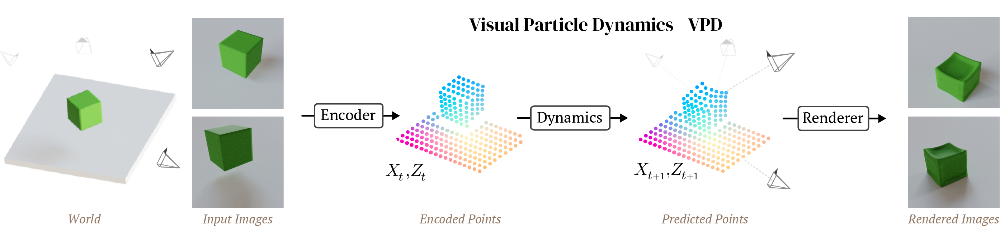

Where simulation is good enough, it is transforming robotics. But it’s nearly impossible to engineer simulators that can accurately model complex physical and visual properties.

Instead of *engineering* such a simulator, why not *train* one? In a new paper, we design an architecture that learns 3D physics simulators by training on multi-view video. It’s essentially a [NeRF](https://www.matthewtancik.com/nerf) that learns a particle-based physics simulator in order to predict the future. We call it Visual Particle Dynamics, or VPD.

Because this model is very expressive, and can in principle be trained on real-world data, it has the potential to overcome the limitations of hand-engineered simulators. And because it uses NeRF for rendering, it can produce high-quality images.



This post describes why I’m excited about simulation, the ingredients that make VPD work, and then finally what the VPD model itself does.

[Paper link](https://arxiv.org/abs/2312.05359)

[Video web site](https://sites.google.com/view/latent-dynamics)

* toc
{:toc}

# Sim to real is transforming robotics

Training robots in the real world is hard. Collecting demonstrations spends endless human hours on menial labor, and you can’t really set your robot loose to collect data on its own — it will inevitable find a way to break its own fingers and drop your favorite mug on the floor. Every experiment is an endless cycle of watching, debugging, resetting, repairing… On a bad day, I think even the real robot devotees harbor a secret wish that they could do the whole mess in sim.

And if you look around, you notice a striking pattern: making a robot do something where our simulations are “good enough” is becoming trivial, while making a robot do something hard to simulate remains basically impossible:

- Locomotion, which can be simulated with simplified physics and observations, is dominated by sim to real. Making a robot walk on varied terrain takes a few hours of training.
- Manipulation in sim requires modeling complex physics like deformation and surface properties and lighting, so there is little adoption of sim to real. State of the art manipulation involves [collecting 130,000 human demonstrations over 17 months](https://arxiv.org/abs/2307.15818) and produces a system that can pick up new objects around 3/4 of the time.



So to summarize: sim to real works incredibly well and everybody wishes they could do it, but sim today isn’t good enough to solve most tasks. Maybe the obvious conclusion is that we should all be working on simulation?

Now I’m not suggesting that you go out and start trying to contribute C code to MuJoCo (though that is commendable!). After all, I’m a deep learner at heart. And for us, every problem is a machine learning problem. So what does the deep learning version of building a simulator look like?

Here are some things we might want:

1. You can train it on real data. After all, the goal is to build a simulator that is good enough to use for sim to real. If you can't train on real data, what's the point?
2. It should be more general than a normal simulator. Lots of materials in the real world are at least a little bit deformable, friction is more complicated than $n$ coefficients, there are subscale textures that affect contacts, and no simulator can model _everything_.
3. It keeps the "nice" properties of normal simulators. You want to have a 3D representation so you can compose a new scene by adding objects, render a camera moving through it, etc.

What would this look like, if we succeeded? We would have _some kind_ of model that can construct a 3D representation from observations, that can handle all the complexities of real dynamics, and that we can use to compose and edit new scenes to simulate.

We’re definitely not there yet.

But our new work is a first step in this direction, and I think it could be the foundation of a new family of simulators.


# Background
Before I go into the details of the model, I’ll give some background on the tools that make this possible.

## Graph network simulators

The first bit of background that will come in handy is on graph network learned simulators, or GNS. For the last few years, a group at DeepMind[^other_gns] has been working with these models across a ton of different physical systems, from [fabric](https://arxiv.org/abs/2010.03409) to [granular materials](https://arxiv.org/abs/2002.09405) to [rigids](https://arxiv.org/abs/2212.03574).





These models use graph neural networks as dynamics models. They represent a scene as a set of points, which may correspond to particles of a sand or fluid or vertices in a mesh. When encoded as a graph network input, each of those points becomes a node in the graph, and points which have some relationship to each other, like close 3D proximity or a shared mesh edge, get edges connecting them. After doing many steps of message passing among these nodes, the GNS predicts a $\Delta x$ for every node.



The key advantage of these models is that they are _local_ and _spatially equivariant_. Because of the way information propagates through a GNS, a change in the state at one end of the workspace doesn’t affect predictions at the opposite end. And because the GNS only observes relative positions, and never global ones, it makes the same predictions if you take all the points and move them somewhere else.

When you put these two properties together, you get something really amazing: each single timestep of training data acts like many separate training points. Consider a homogeneous material like sand: each particle of sand follows the same physical laws as every other particle of sand. So if you have one trajectory with a thousand sand particles, the GNS trains _almost_ as if you have a thousand trajectories in your training set. In reality the GNS softly observes a region of particles instead of just one, so maybe it’s like a hundred trajectories, or maybe just ten. But they exhibit impressive data efficiency.

And by the same token, a GNS can generalize compositionally. After all, the model only defines the local behavior of particles. It never even knows whether there are a thousand sand particles or a million, so it doesn’t break if you train on a thousand and test on a million.

So GNS models are pretty incredible. So far, though, they’ve always relied on having ground-truth states: particles which persist and move over time, completely specifying the state of the system. That’s more or less impossible to get in the real world. You can approximate it by having CAD models of everything you want to observe and sticking QR codes all over, but even that only works for rigids.

## NeRF

The other tool we need is [Neural Radiance Fields](https://arxiv.org/abs/2003.08934), more commonly known as NeRF.



You might already be familiar with NeRF, but in case you’re not: NeRF trains a neural network to predict the _color_ and _density_ of a location in space, and renders a _ray_ by querying this network at many XYZ points along the ray.

{% include figure.html url="/assets/img/learned-simulators/Untitled%201.png" caption="Credit: NeRF, <a href=\"https://arxiv.org/abs/2003.08934\">https://arxiv.org/abs/2003.08934</a>" %}

In this way, a trained NeRF encodes the 3D appearance of a single scene. It generalizes over camera positions by construction, but it has no ability to generalize over new scenes. To get a NeRF for a version of the scene where some objects have moved and the weather is cloudy you have to train a new NeRF from scratch.

NeRF’s results are incredible, but there is one specific thing that NeRF does that I think is still deeply under-appreciated years later: NeRF gives us a way to turn 2D supervision into 3D supervision. Multi-view consistency turns out to be the Rosetta stone of 3D machine learning. People (including me! my first paper was about this!) have been wanting to learn things about the 3D world forever, and these efforts have always been frustrated by the fact that we only ever have 2D images. No longer.

## Point-NeRF

An interesting extension to NeRF is [Point-NeRF](https://xharlie.github.io/projects/project_sites/pointnerf/). Instead of having the weights of the model represent the state of the world, Point-NeRF has an explicit representation: points in space tagged with latent vectors. When rendering some location in space $x$, the Point-NeRF MLP doesn’t directly observe $x$ like a NeRF would. Instead, the Point-NeRF gets information derived from points in the local neighborhood, and those points must contain all the features needed for the Point-NeRF to render.

{% include figure_multi.html url="/assets/img/learned-simulators/Untitled%202.png,/assets/img/learned-simulators/Untitled%203.png" %}

With this explicit scene representation, Point-NeRF unlocks the ability to generalize over scenes. Instead of training a new Point-NeRF for each scene, you can just point its image encoder at a few views of the scene and get your point cloud instantly. This extra structure also lets you get away with only a few views per scene instead of the very dense coverage that NeRF needs.

{%include figure.html url="/assets/img/learned-simulators/Untitled%204.png" caption="Credit: Point-NeRF, <a href=\"https://xharlie.github.io/projects/project_sites/pointnerf/\">https://xharlie.github.io/projects/project_sites/pointnerf/</a>" %}

# Visual Particle Dynamics

The fundamental limitation of graph network simulators has always been that they require a form of supervision which is totally impractical to collect: ground-truth 3D locations of every point representing a scene at every moment in time. The core insight of VPD is that NeRF’s ability to supervise 3D information using 2D observations exactly addresses this weakness. If we had a GNS that could perceive a scene and render its predictions, we could supervise it with easy-to-collect video.



VPD does exactly this. It applies the simulation architecture of a GNS to the particle representation of a Point-NeRF, combining perception, dynamics, and rendering in one pipeline that can be trained end to end.


## Overview



Visual Particle Dynamics, or VPD, has three key components:

- First is an encoder that takes one or more posed images describing a scene and encodes them into a set of particles in 3D space, each with a latent feature vector.
- Next is a dynamics model that transforms the observed particles at step $t$ to predicted particles at step $t+1$.
- Finally we have a renderer, which uses ray-based rendering to decode the set of points into an image from a queried camera pose.

Putting it all together, VPD is a video prediction model: given a couple of frames, it can predict the rest of the video. But it’s also more than that. Because it has a 3D representation of the world and a 3D renderer, it supports 3D editing of the underlying scene during simulation and arbitrary camera motion. Most importantly of all, it can be trained end-to-end on data you could actually collect and still keep all these nice 3D tricks.


## Encoder

{% include figure.html url="/assets/img/learned-simulators/Untitled%205.png" caption="The VPD encoder applies a convnet to produce a latent vector for every pixel, then uses depth data and camera geometry to turn those latent vectors into 3D particles." %}

The first component of VPD is the encoder, which turns every pixel in the input images into a particle in 3D space, each one tagged with a latent vector. For Point-NeRF, the latent vectors carry information about the visual appearance of that point, but since VPD is trained end to end its latent vectors will also capture something about geometry and physical properties.

These observations (and particles) can come from however many cameras as we have. For now we assume that our data is in the form of multi-view RGB-D videos, such as would be recorded by multiple depth cameras, but in the paper we find that using a monocular depth estimation model works almost as well.

## Dynamics

Next we have a dynamics model in the form of a graph network. This GNN takes the particles from the encoder and predicts how they will change. It moves them in 3D space, representing motion, and changes the features of the latent vector, representing changes in appearance such as shadows.

{% include figure.html url="/assets/img/learned-simulators/Untitled%206.png" caption="A hierarchical graph network. Past and present observations (blue and green particles) send information to abstract nodes. The abstract nodes communicate amongst themselves, then predict the motion of the present particles." %}

Previous GNS architectures have used the velocity of each point as an input to the model. They assumed access to ground-truth 3D information, including correspondences between points at different times, but camera data has no such thing; there is no easy way to “track” the motion of every pixel in a video, especially not with occlusion. Instead, VPD simply gives all the particles from multiple timesteps to a giant graph network asks it to figure it out.

{% include figure.html url="/assets/img/learned-simulators/Untitled%207.png" caption="The graphs are big enough to be… challenging." width=400 %}

Multiple timesteps’ worth of pixels from multiple cameras rapidly becomes a tremendous number of points. To deal with these huge graphs more efficiently, VPD uses a hierarchical graph network, where most of the message passing work happens on a small set of more abstract particles. All the messy details of this are in [the paper](https://arxiv.org/abs/2312.05359), but really this is just a computational optimization. This GNN acts much like those in previous GNS models, with the dynamics of one side of the scene largely independent of the other.

## Rendering

Finally, after the dynamics model predicts how the particles move and change over time, the renderer can take that prediction and turn it into an image. Just like Point-NeRF, the VPD renderer predicts color and density at a location in space given features from the particles near that location. That means that in order to render some $(x, y, z)$ correctly, the right particles need to be nearby.



This is the engine that drives training for the whole model: if our ducky ends up with its face at $(2, -1, 1)$, and the particles representing that face are predicted at $(2, -1, 1.5)$, the dynamics model will get a gradient to move those particles down to the right place so that the renderer can put the right colors there.

# The simulator of the future?

As all the gifs in this post show, VPD has some capabilities that normal simulators would struggle on, like simulating deformables and making renders match ground truth. But what I’m most excited about is what it *shares* with other simulators: an interpretable, editable 3D representation of a scene. Unlike a 2D video model, you can “clone” a real scene by passing it through the VPD encoder, and then interact with its particle representation to make something new. Here’s an example of removing certain objects from the scene:



This is a simple edit, but you could imagine creating a library of objects (with a few images and one forward pass each) and re-combining them at will. The particle representation is easy to interpret and visualize, making editing much simpler.

Since VPD models dynamics and appearance as local properties, it supports the composition and simulation of much larger scenes at test time. Just grab all the particles you want from various examples and stick them together.



This is just the beginning, and there are so many research directions on top of VPD. There are various improvements that I see as low-hanging fruit:

- Currently the model is fully deterministic, which leads to blurry predictions when there is uncertainty or chaotic dynamics. I would love to see a fully generative version of VPD, which could challenge 2D video models in terms of image quality while maintaining VPD’s highly accurate dynamics.
- VPD knows a lot about dynamics, but nothing about semantics. It would be interesting to run something like [Segment Anything](https://segment-anything.com/) on the images to add object identity as a feature to every particle. Since VPD particles track objects throughout their rollouts, this would straightforwardly enable predictions of object-level motion and behavior.
- The hierarchical GNS architecture is very memory-intensive, and efficiency improvements would lead to big quality improvements. We currently use $2^{14}$ points and train on 6-step rollouts, and we know that increasing those numbers produces big gains in fidelity, not to mention making it possible to train on very large scenes.

Perhaps in the future robotics will rely on simulators like these. Imagine cloning a new task into simulation just by pointing a camera at it, then fine-tuning a policy to solve it via sim to real. Or a simulator that matches the real world more closely with every experiment you run on hardware, continually adapting to new objects and becoming more capable. Or the “foundation model” of learned simulators, trained on all the world’s data and in turn able to safely train robots to interact with humans, cars, and the world outside the lab.

That’s a future of robotics that I’d like to see.

# Acknowledgements and citation

This work would not have been possible without my amazing co-authors, Tatiana Lopez-Guevara, Tobias Pfaff, Yulia Rubanova, Thomas Kipf, Kim Stachenfeld, and Kelsey Allen. This post only represents my own views, though, so don’t blame them if I’ve said something outrageous.

Here’s the bibtex for our paper, in case it becomes relevant in your own work:

```latex
@inproceedings{
	whitney2024learning,
	title={Learning 3D Particle-based Simulators from {RGB}-D Videos},
	author={William F. Whitney and Tatiana Lopez-Guevara and Tobias Pfaff and Yulia Rubanova and Thomas Kipf and Kimberly Stachenfeld and Kelsey R. Allen},
	booktitle={The Twelfth International Conference on Learning Representations},
	year={2024},
	url={https://openreview.net/forum?id=4rBEgZCubP}
}
```

[^other_gns]: And others in parallel, e.g. [DPI-Net](http://dpi.csail.mit.edu) from a group at MIT.