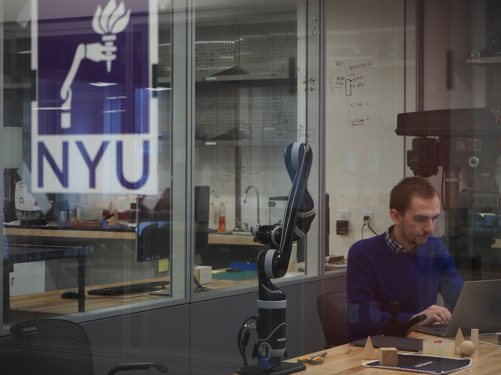

I'm Will Whitney, a research scientist at DeepMind. I got my PhD working with Kyunghyun Cho at NYU. Before that I worked with Josh Tenenbaum and Tejas Kulkarni at MIT for my Master's. In a past life I started a company and went through Y Combinator. I also created [Hydrogen](https://atom.io/packages/hydrogen), an interactive coding environment for the Atom text editor, which was downloaded >2,000,000 times.

## Research interests
Currently my research is about learning models of the physical world. I want to build generative models good enough to live inside of, whether for fun and games, to do [work](/computing-inside-ai.html), or to [train agents](/learned-simulators.html). This touches diffusion and video generation, 3D physics modeling, NeRF, and lots more.

I got into working on world models through robotics. Every problem in robotics that we can simulate sufficiently well is now relatively easy to solve. Every problem that we can't simulate is basically impossible and requires thousands of hours of human demonstrations to get results. To me, that implies that scaling simulation and making it cheap to author huge, near-perfect simulators of new scenes is plausibly the best way to make progress in robotics. This is especially true since progress on video generative models is so fast.

## Selected publications

This page is typically outdated, so refer to my [Semantic Scholar](https://www.semanticscholar.org/author/William-F.-Whitney/3376546) instead.

William F. Whitney[^1], Tatiana Lopez-Guevara[^1], Tobias Pfaff, Yulia Rubanova, Thomas Kipf, Kimberly Stachenfeld, and Kelsey R. Allen. [Learning 3D Particle-based Simulators from RGB-D Videos](/assets/papers/Learning.3D.Particle.Simulators.pdf). In _International Conference on Learning Representations_, 2024.

Kelsey R. Allen[^1], Yulia Rubanova[^1], Tatiana Lopez-Guevara, William F. Whitney, Alvaro Sanchez-Gonzalez, Peter Battaglia, and Tobias Pfaff. [Learning rigid dynamics with face interaction graph networks](/assets/papers/Learning.rigid.dynamics.pdf). Spotlight in _International Conference on Learning Representations_, 2023.

David Brandfonbrener, William F. Whitney, R. Ranganath, and Joan Bruna. [Offline RL Without Off-Policy Evaluation](/assets/papers/Offline.RL.Without.OPE.pdf). In _Neural Information Processing Systems_, 2021.

William F. Whitney, Michael Bloesch, Jost Tobias Springenberg, Abbas Abdolmaleki, and Martin Riedmiller. [Decoupled Exploration and Exploitation Policies for Sample-Efficient Reinforcement Learning](assets/papers/Decoupled.Exploration.and.Exploitation.pdf). [_arXiv:2101.09458_](https://arxiv.org/abs/2101.09458), 2021.

David Brandfonbrener, William F. Whitney, Rajesh Ranganath, and Joan Bruna. [Offline Contextual Bandits with Overparameterized Models](assets/papers/Offline.Contextual.Bandits.with.Overparameterized.Models.pdf). In _International Conference on Machine Learning_, 2021.

William F. Whitney, Min Jae Song, David Brandfonbrener, Jaan Altosaar, and Kyunghyun Cho. [Evaluating representations by the complexity of learning low-loss predictors](assets/papers/Evaluating.representations.by.the.complexity.of.learning.low.loss.predictors.pdf). [_arXiv:2009.07368_](https://arxiv.org/abs/2009.07368), 2021.

William F. Whitney, Rajat Agarwal, Kyunghyun Cho, and Abhinav Gupta. [Dynamics-aware Embeddings](assets/papers/Dynamics.aware.Embeddings.pdf). In _International Conference on Learning Representations_, 2020.

William F. Whitney and Rob Fergus. [Disentangling video with independent prediction](assets/papers/Disentangling.video.with.independent.prediction.pdf). In _Learning Disentangled Representations: from Perception to Control_ at NeurIPS'17. 2017.

Mikael Henaff, William F. Whitney, and Yann LeCun. [Model-Based Planning with Discrete and Continuous Actions](assets/papers/Model.Based.Planning.with.Discrete.and.Continuous.Actions.pdf). _arXiv preprint arXiv:1705.07177_, 2017.

Vlad Firoiu, William F. Whitney, and Joshua B. Tenenbaum. [Beating the world’s best at Super Smash Bros. with deep reinforcement learning](assets/papers/Beating.the.Worlds.Best.pdf). [_arXiv:1702.06230_](https://arxiv.org/abs/1702.06230), 2017.

William F. Whitney. [Disentangled Representations in Neural Models](assets/papers/Disentangled.Representations.in.Neural.Models.pdf). Master's thesis, Massachusetts Institute of Technology, 2016.

William F. Whitney, Michael Chang, Tejas Kulkarni, and Joshua B. Tenenbaum. [Understanding visual concepts with continuation learning](assets/papers/Understanding.Visual.Concepts.with.Continuation.Learning.pdf). In _International Conference on Learning Representations, Workshop Track_, 2016.

Tejas D. Kulkarni[^1], William F. Whitney[^1], Pushmeet Kohli, and Joshua B. Tenenbaum. [Deep convolutional inverse graphics network](assets/papers/Deep.Convolutional.Inverse.Graphics.Network.pdf). Spotlight in _Advances in Neural Information Processing Systems_, 2015.

[^1]: Equal contribution.
